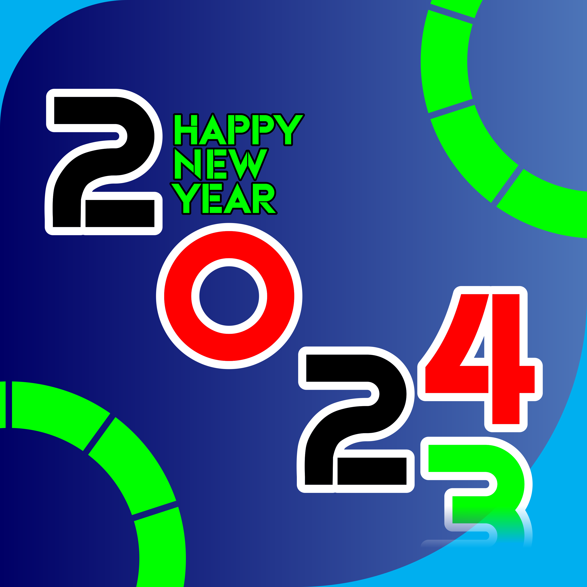

# Feliz Año Nuevo 2024

Un día desperté e imaginé tener una barra de progreso que marque el porcentaje completado del año, basado en el 100%, sobre una pizarra que tengo en mi dormitorio. Esta es una manera visual de ver cómo avanza el año y algo que me motiva a seguir. Para abordar esto, diseñé algunas fórmulas matemáticas que no sabía cómo hacer, pero después de varios minutos las ideé y las llevé a código. Además, distribuí ese porcentaje numérico del año completo en una barra dentro de un LCD 16x2. Estos datos son enviados al puerto serie desde un script de Python y son leídos por el Arduino para procesarlos y visualizarlos como un progreso de barra. Pero este proyecto tiene un elemento adicional: cuando sea Año Nuevo 2024, mostrará "Feliz Año Nuevo" en inglés en la pantalla LCD. Hasta aquí llega el programa en el LCD.

# Componentes
- Arduino Uno R3 (Cerebro)
- LCD 16x2 (Pantalla)
- Piezoeléctrico (reproducir sonido alegre)

# Resultados
Como resultado de este proyecto:
- Visualizar el progreso del año sin tener que hacer cálculos, todo de manera visual.
- Recibir una bienvenida tecnológica al 2024.
